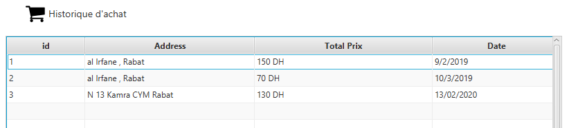
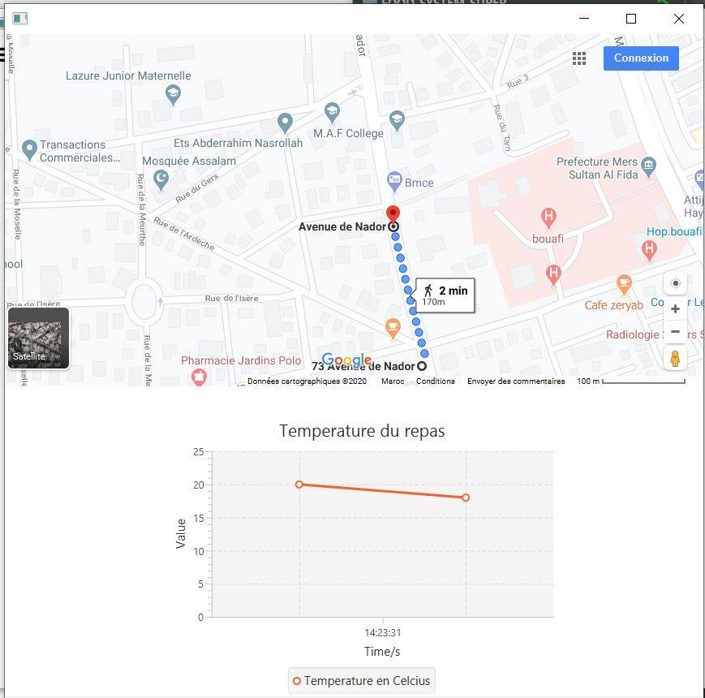

## Food Delivery System
The main purpose of our application is to allow users to minimize travel time to
restaurants and enjoy their home food in a short time by viewing the progress of
their order, thus facilitating the task of order management for restaurants, thus
offering an optimal path for deliveries, with several IoT-based functionalities.

## 🤓 Authors
**Yassine Boujnah** 
**Ilyass TARHRI** 

## ScreenShots
### Search food

### Select food

### Show orders

### Confirm orders & Select destination
 &nbsp;&nbsp;&nbsp;&nbsp; 

### History & Profile
&nbsp;&nbsp;&nbsp;&nbsp; 

### Track orders

## ✨ Requirements
* Any Operating System (ie. MacOS X, Linux, Windows)
